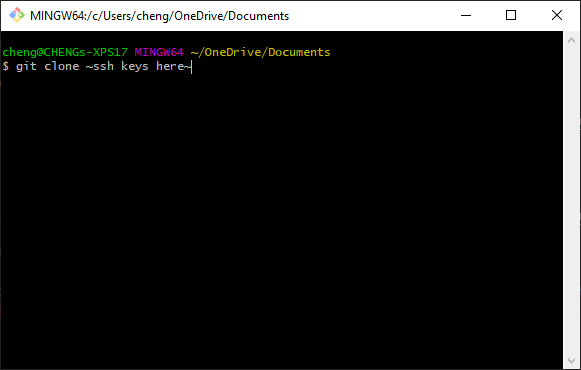

# Accessibility for All & Code Refactoring

With accessibility being a meaningful but often neglected and underserved aspect of the internet Horiseon has made it a their mission to provide their services to all patrons. In this project of **Accessibility for All**, we will be using the homepage as the foundation, and cascading it down to the entire site. In addition to this, we will doing some **Code Refactoring**.

## Getting Started

Please visit https://github.com/cheng21tang/Code-Refactor to get a copy of the project.
- Clone a copy of the repository **/Code-Refactor**

### Prerequisites

Application requirements: 
1. [Chrome](https://www.google.com/chrome/?brand=CHBD&brand=YTUH&geo=US&gclid=Cj0KCQjw0caCBhCIARIsAGAfuMzoKPZm0G8kzj0715gVY5J62pfCADuGpXMDU4xoS0VoeDcdF5Fy6KcaAjqtEALw_wcB&gclsrc=aw.ds)
2. [GitHub](https://github.com/)
3. [GitBash](https://git-scm.com/downloads)
4. [VS Code](https://code.visualstudio.com/download)

Install **Chrome**, **GitBash**, and **VS Code** on your machine. Then visit [GitHub](https://github.com/) and sign-in or create an account.

### Installing

After signing into [GitHub](https://github.com/) visit the link in **Getting Started** [https://github.com/cheng21tang/Code-Refactor] and clone a copy of the repository using your SSH keys and GitBash.

1. [GitHub](https://docs.github.com/en/github/creating-cloning-and-archiving-repositories/cloning-a-repository) Cloning a respository

## Built With

* [HTML](https://developer.mozilla.org/en-US/docs/Web/HTML)
* [CSS](https://developer.mozilla.org/en-US/docs/Web/CSS)
* [Javascript](https://developer.mozilla.org/en-US/docs/Web/JavaScript)
* [w3schools](https://www.w3schools.com/html/html_accessibility.asp)
* [w3schools](https://www.w3schools.com/html/html5_semantic_elements.asp)
* [w3schools](https://www.w3schools.com/html/html5_syntax.asp)
* [w3schools](https://www.w3schools.com/css/css_navbar.asp)
* [w3](https://www.w3.org/TR/selectors-3/#def-values)
* [css-tricks](https://css-tricks.com/multiple-class-id-selectors/)
* [sitepoint](https://www.sitepoint.com/community/t/a-href-tag-not-working/6212)

## Deployed Link

* [cheng21tang.github.io/Code-Refactor](https://cheng21tang.github.io/Code-Refactor/)

## Authors

* **CHENG TANG** 

- [Link to Github](https://github.com/cheng21tang)
- [Link to LinkedIn](https://www.linkedin.com/in/cheng-tang-0663211a3/)

See also the list of [contributors](https://github.com/cheng21tang/Code-Refactor/graphs/contributors) who participated in this project.

## License

This project is licensed under the MIT License 

## Acknowledgments

* Hat tip to anyone whose code, libraries, packages, or UI was used
